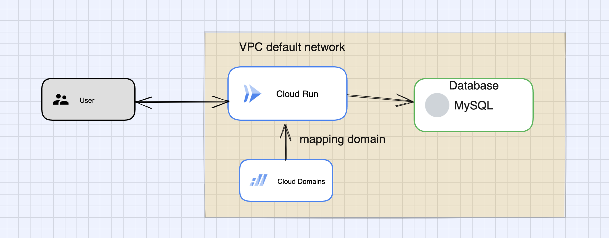

# No Code Product

Let's suppose you are the DevOps engineer of NoCode product  (It's not real, it's just hypothetical). This NoCode product allows you to generate an application code. It is considered as NoCode because it can be easily used by people in the sales and marketing fields, but inside the product system, it generates the application project like a code generator.

Users should be able to make a web application public with a single click, and they can get the URL of the project that they have created on the NoCode product. The development team is now considering how to implement this user story.

## Product situation

- The NoCode product is still in development, nobody created servers for the product yet, and it’s not deployed to the production.
- The users of the product are people in the sales and marketing field who have no software engineering knowledge.
- The concept of being able to download the code of a web application is the strength of the product. This time we want to utilize this characteristic.

## Requirements

- User story: Users are be able to make a web application public with a single click, and they can get the URL of the project that they have created on the NoCode product.
- The URL that users can get looks like this, `random.product.com` . `random` is CNAME, and `product.com` is the host of the NoCode product.
- The deployed web application from NoCode product needs to be reliable and scalable.
- Users have no knowledge of software engineering, so the server needs to be as maintenance-free as possible.
- The shorter the time from when the user clicks the button to when the website is launched, the better.
- We can use any kind of solutions, but basically we like to use AWS, GCP and Azure.

## Design Decision:
Cloud run help to leverage from code to containerized application for user without the need of setup server beforehand. It also a highly scalable system and mainternance free.

## Appling IaC
- cd .tf
- terraform init -backend-config=production.backend -reconfigure -upgrade
- terraform apply
